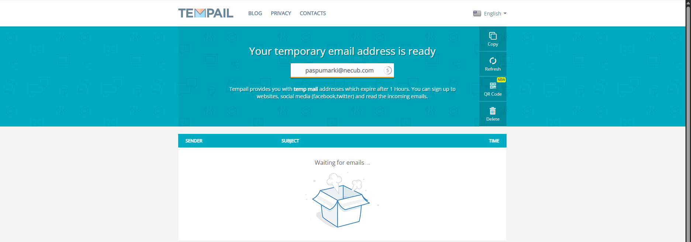
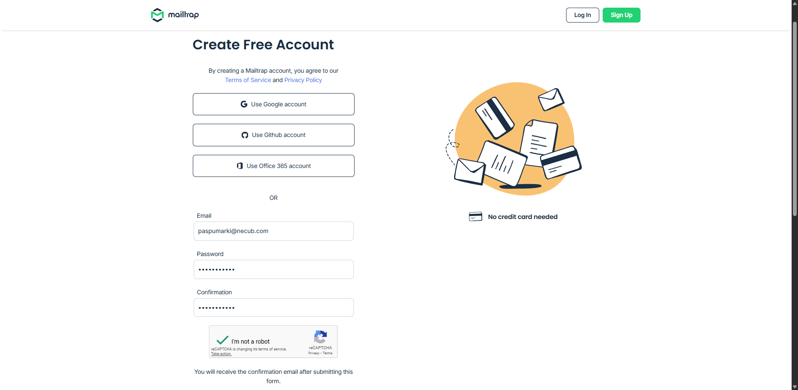
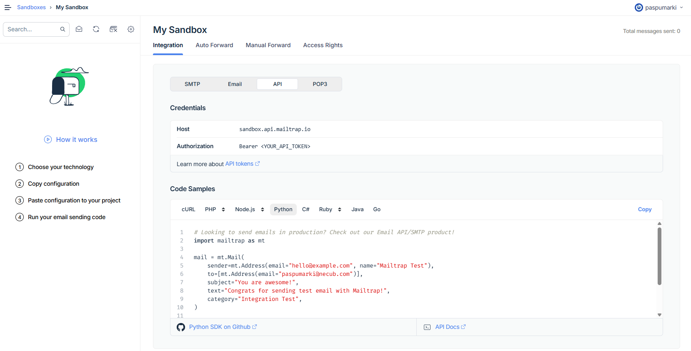
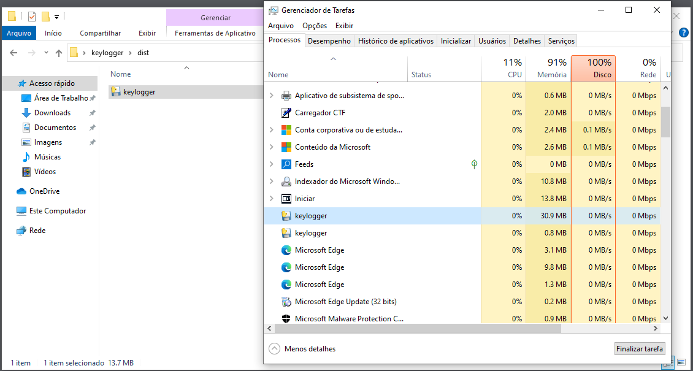
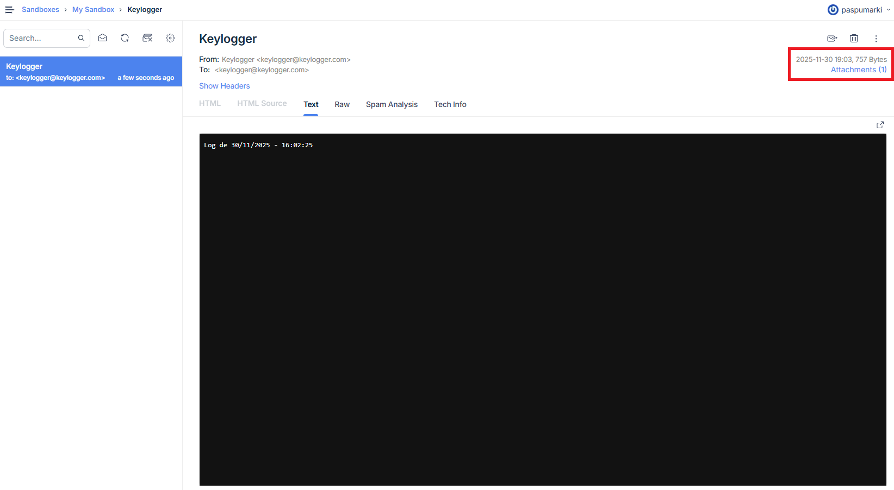
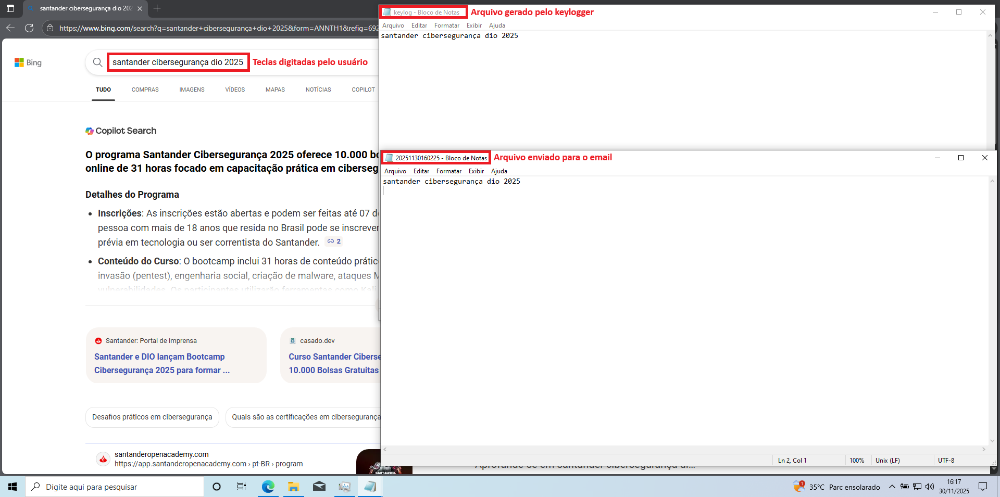

# Keylogger Simulado
## 🧩 Descrição do Desafio:
- Implementar, documentar e compartilhar um projeto prático utilizando Python e bibliotecas como pynput e mailtrap para simular cenários de ataque por Keylogger.

- Configuração do ambiente: diretório controlado com arquivos de teste, criação de email temporário e arquivo executável para torná-lo mais furtivo.

- Executar operações simuladas: gerar um arquivo .txt com a captura das teclas pressionadas pelo usuário e enviá-lo por email.

- Documentar os testes: arquivos utilizados, comandos executados e recomendações de segurança.

---
## 📌 Descrição do ataque:
O ataque de Keylogger consiste em monitorar tudo o que é digitado pelo usuário, afim de coletar (principalmente) informações sensíveis. Este é uma simulação controlada para fins educacionais, demonstrando como funciona o processo de captura de teclas e envio por email com Python.

---
## 🔧 Preparando o ambiente:
Com o Python 3 instalado, precisamos adicionar a biblioteca *pynput*, a qual vai capturar as teclas pressionadas pelo usuário, e a biblioteca *mailtrap* para enviá-las ao email do atacante. Também vamos precisar da biblioteca *pyinstaller* para criar um arquivo executável a partir do script python. Vamos abrir o terminal e executar o comando:

``` bash
pip install -r requirements.txt
```

---
## 📧 Utilizando email anônimo:
Para tornar o nosso Keylogger mais anônimo e furtivo, precisamos de uma conta de email temporária. Para isso, usei os serviços do *[Temp Mail](https://tempail.com/)* e, como a grande maioria destes serviços não permitem o envio de email, vamos usar também os serviços do [Mailtrap](https://mailtrap.io/). Ambos são gratuitos.

#### ✉️ Criação de conta de email:

Vamos acessar a página do *[Temp Mail](https://tempail.com/)* para gerar um email temporário.


Com o nosso email temporário, vamos criar uma conta no [Mailtrap](https://mailtrap.io/register/signup).


Basta seguir preenchendo as informações solicitadas e, no final do processo, confirmar o email enviado para nosso email temporário.

#### ⛓️ Configurando a API para enviar e receber emails:
Uma grande vantagem do *Mailtrap* é a integração da sua API com o Python.
Com a nossa conta ativada, vamos acessar nossa Sandbox e criar um API Token para enviar e receber emails com as informações do Keylogger.  
Vamos seguir para *Sandboxes > My Sandbox > API > Create API Token*. Este token deve ser guardado em um local seguro.  
Pronto. Nossa Sandbox está pronta para receber os dados do Keylogger.


 Podemos ver que a própria API já nos fornece o código necessário para o envio de emails.

*Integration > API > Python*
 ```python
 # Looking to send emails in production? Check out our Email API/SMTP product!
import mailtrap as mt

mail = mt.Mail(
    sender=mt.Address(email="hello@example.com", name="Mailtrap Test"),
    to=[mt.Address(email="<YOUR_TEMP_MAIL>")],
    subject="You are awesome!",
    text="Congrats for sending test email with Mailtrap!",
    category="Integration Test",
)

client = mt.MailtrapClient(token="<YOUR_API_TOKEN>", sandbox=True, inbox_id="<YOUR_INBOX_ID>")
response = client.send(mail)

print(response)
 ```

---
## 👻 Tornando o Keylogger mais furtivo:
Para não ter que executar o Keylogger através de um terminal de linha de comando, nem depender da necessidade do Python instalado na máquina do usuário, vamos utilizar a biblioteca *pyinstaller* para criar um arquivo executável.  
Vamos abrir um terminal no diretório do *keylogger.py* e digitar `pyinstaller ./keylogger.py -F -w`. Esse comando vai criar um executável *keylogger.exe* na pasta *dist*, no qual pode ser executado diretamente pelo Windows, dispensando um terminal ou qualquer janela.


---
## 👁️ Capturando as teclas:
O keylogger deste projeto foi programado para iniciar um timer e gravar um arquivo chamado *keylog.txt* sempre que o usuário pressionar uma tecla. Caso a vítima pare de digitar por 10 segundos, o keylogger automaticamente envia o arquivo capturado para o email do atacante. 




---
## ⚠️ Recomendações de segurança:
- Este projeto é apenas para fins educativos. Use apenas em ambiente controlado.

---
## 🛡️ Reflexão sobre defesa:
A simulação de um keylogger permite compreender como ataques reais podem comprometer dados e sistemas.  
Para reduzir riscos, algumas medidas de defesa são fundamentais:

- **Antivírus e Antimalware:** detectar e bloquear comportamentos suspeitos.  
- **Firewall e Monitoramento de Rede:** identificar tráfego anômalo e impedir conexões maliciosas.  
- **Sandboxing:** executar programas em ambientes isolados para análise segura.  
- **Conscientização do Usuário:** não utilizar programas piratas, evitar abrir anexos suspeitos, links desconhecidos e manter boas práticas digitais.  

Essas estratégias reforçam a importância de unir tecnologia e educação para prevenir ataques e proteger informações.

---
## 📚 Recursos:
### Slide:
- [Simulando um Malware de Captura de Dados Simples em Python e Aprendendo a se Proteger](https://hermes.dio.me/files/assets/650964f8-ee9d-411f-8b6b-bcbb2c66177e.pdf)

### Softwares e Ferramentas:
- [Python 3.13](https://www.python.org/)
- [Visual Studio Code](https://code.visualstudio.com/)

### Documentações oficiais:
- [Python – Documentação Oficial](https://www.python.org/doc/)
- [Mailtrap](https://api-docs.mailtrap.io/docs/mailtrap-api-docs/)
- [pynput](https://pynput.readthedocs.io/en/latest/)
- [pyinstaller](https://pyinstaller.org/en/v6.17.0/)